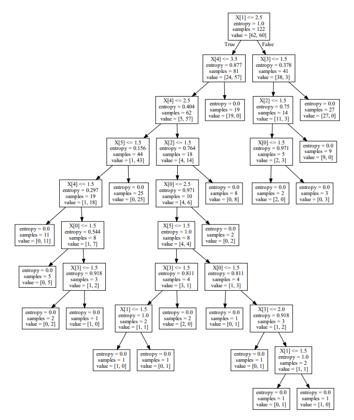
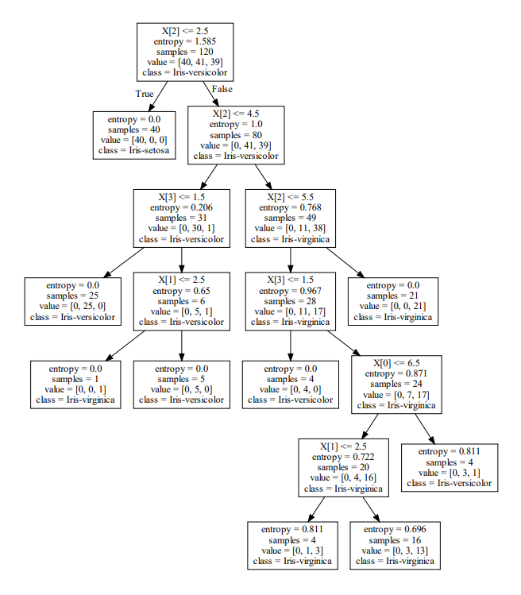

# README

### First step is to install the necessary requirements for the code


The python packages that are required are present in the requirements file 

## Requirements 

```
pip install -r requirements.txt
```


### We also need to install Graphviz for our OS

## For Linux Based OS'

```
sudo apt-get install graphviz
```

## For Windows 

<ol>
  <li>Download Graphviz from http://www.graphviz.org/download/ </li>
  <li> Add below to PATH environment variable (mention the installed graphviz version): </li>
 </ol>
 
 >  C:\Program Files (x86)\Graphviz2.38\bin <br> C:\Program Files (x86)\Graphviz2.38\bin\dot.exe


### After installing the necessary files we are ready to run the program

## Usage

Use the below ccode to run the decision tree program

```
python decision_tree.py
```

## Info

The report in the folder contains information on the solution to different parts of the assignment.

## Sample Images 

#### Visualization of Monks-1 Decision Tree by Sklearn


#### Visualization of Iris Decision Tree by Sklearn

