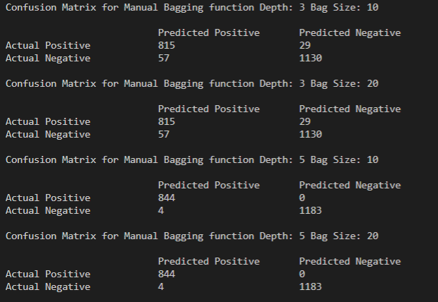
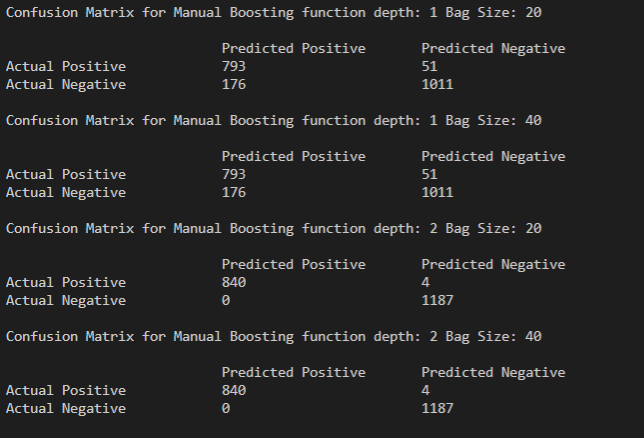
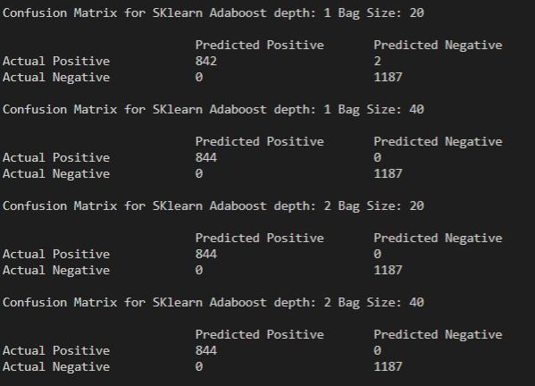

# README

### First step is to install the necessary requirements for the code


The python packages that are required are present in the requirements file 

## Requirements 

```
pip install -r requirements.txt
```

### After installing the necessary files we are ready to run the program

## Usage

Use the below ccode to run the decision tree program

```
python ensemble.py
```

## Confustion Matrix Outputs

#### Confusion Matrix for the Bagging Implementation


#### Confusion Matrix for the Boosting Implementation


#### Sklearn Bagging Output


#### Sklearn Adaboost Output

